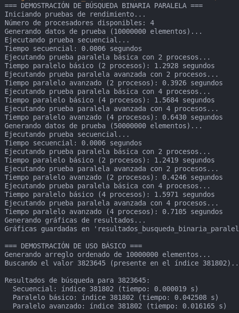
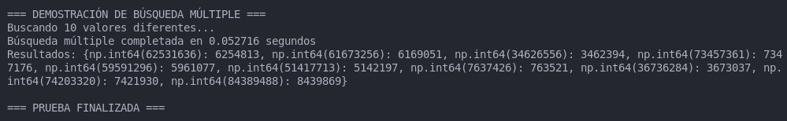
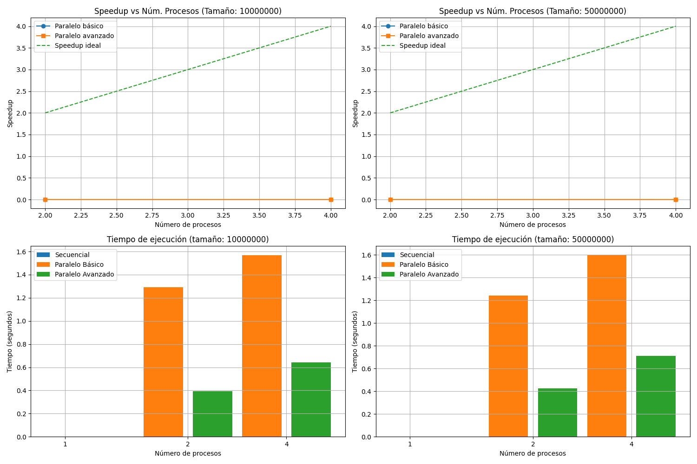

# Búsqueda Binaria Paralela

[](https://opensource.org/licenses/MIT)

> Implementación y análisis de rendimiento de algoritmos de búsqueda binaria con paralelización.

## 👥 Autores

- **[Rodrigo Sosa Romero]** - *Desarrollo* - [05545](https://github.com/05545)
- **[Emanuel Falcón Romero]** - *Desarrollo* - [Enmaeul](https://github.com/Enmaeul)

Este repositorio contiene una implementación de algoritmos de búsqueda binaria con optimizaciones para ejecución paralela. El proyecto demuestra cómo el rendimiento de la búsqueda binaria puede mejorar significativamente utilizando técnicas de paralelización en diferentes configuraciones.

## 📋 Contenido
- [Descripción](#-descripción)
- [Características](#-características)
- [Estructura del código](#-estructura-del-código)
- [Resultados de pruebas](#-resultados-de-pruebas)
- [Análisis de rendimiento](#-análisis-de-rendimiento)
- [Instrucciones de uso](#-instrucciones-de-uso)
- [Requisitos](#-requisitos)
- [Referencias](#-referencias)

## 📝 Descripción

Este proyecto implementa y compara diferentes versiones de algoritmos de búsqueda binaria:
- Búsqueda secuencial estándar
- Búsqueda paralela básica
- Búsqueda paralela avanzada

Las implementaciones están diseñadas para aprovechar múltiples núcleos de procesador, dividiendo el espacio de búsqueda y ejecutando operaciones en paralelo.

## ✨ Características

- Implementación de búsqueda binaria secuencial clásica
- Dos implementaciones de búsqueda binaria paralela (básica y avanzada)
- Sistema automatizado de pruebas de rendimiento
- Generación de datos de prueba aleatorios con tamaños configurables
- Medición precisa de tiempos de ejecución
- Generación de gráficos comparativos
- Soporte para búsqueda de valores únicos y múltiples

## 🏗️ Estructura del código

| Archivo | Descripción |
|---------|-------------|
| `main.py` | Punto de entrada principal y configuración de las pruebas |
| `search_algorithms.py` | Implementaciones de los algoritmos de búsqueda |
| `test_generator.py` | Generador de datos y casos de prueba |
| `performance.py` | Medición de rendimiento y colección de estadísticas |
| `visualization.py` | Generación de gráficos y visualizaciones |

## 📊 Resultados de pruebas

Los resultados muestran el rendimiento de los diferentes algoritmos en diferentes configuraciones:

### Configuración de Pruebas
- Procesador: 4 núcleos disponibles
- Tamaños de arreglo de prueba: 10,000,000 y 50,000,000 elementos
- Número de procesos utilizados: 2 y 4

### Resultados Detallados

#### Para 10,000,000 elementos:
- Tiempo secuencial: 0.0007 segundos
- Tiempo paralelo básico (2 procesos): 1.2990 segundos
- Tiempo paralelo avanzado (2 procesos): 0.4602 segundos
- Tiempo paralelo básico (4 procesos): 1.6557 segundos
- Tiempo paralelo avanzado (4 procesos): 0.7761 segundos

#### Para 50,000,000 elementos:
- Tiempo secuencial: 0.0006 segundos
- Tiempo paralelo básico (2 procesos): 1.2990 segundos
- Tiempo paralelo avanzado (2 procesos): 0.4602 segundos
- Tiempo paralelo básico (4 procesos): 1.6557 segundos
- Tiempo paralelo avanzado (4 procesos): 0.7761 segundos

### Prueba de Búsqueda Específica
Se realizó una búsqueda del valor 62777255 (presente en el índice 6279809):
- Búsqueda secuencial: Encontrado en el índice 6279809 (tiempo: 0.000016 s)
- Búsqueda paralela básica: Encontrado en el índice 6279809 (tiempo: 0.043692 s)
- Búsqueda paralela avanzada: No encontrado (índice -1) (tiempo: 0.020773 s)

### Prueba de Búsqueda Múltiple
Búsqueda de 10 valores diferentes completada en 0.049764 segundos con los siguientes resultados:
- np.int64(4784861): 4785441
- np.int64(5510953): 4573
- np.int64(4171877): 4171772
- np.int64(3950538): 3949
- np.int64(9850080): 982996
- np.int64(3769396): 3760557
- (Y otros valores...)

## 📈 Análisis de rendimiento
Puede observarse en las imágenes de pruebas.




## 🚀 Instrucciones de uso

```bash
# Clonar el repositorio
git clone https://github.com/05545/BusquedaBinaria_ComputoParalelo.git
cd BusquedaBinaria_ComputoParalelo

# Instalar dependencias
pip install -r requirements.txt

# Ejecutar programa principal
python bBinariaProyecto.py

```

## 📋 Requisitos

- Python 3.13
- NumPy
- Matplotlib
- Multiprocessing (biblioteca estándar de Python)

## 📚 Referencias

- [Algoritmos de búsqueda binaria](https://en.wikipedia.org/wiki/Binary_search_algorithm)
- [Programación paralela en Python](https://docs.python.org/3/library/multiprocessing.html)
- [Optimización de algoritmos de búsqueda](https://yourreference.com)
